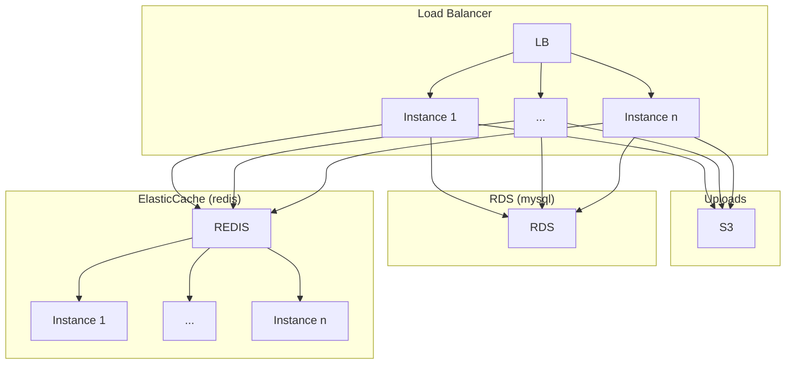

# CTFd AWS Terraform module

Terraform module to deploy [CTFd](https://ctfd.io/) into scalable AWS infrastructure

*WARNING* This module has never been battle tested. It was developed for use in a CTF for a security conference that was cancelled due to COVID-19. The author is neither a CTFd developer nor a cloud expert and did this module partially as a learning exercise. That's not to say you shouldn't use it but if you do plan on using it, and have expertise, it would be great to have feedback/contributions on both the deployment model and terraform coding. Further you almost certainly want to scale out the instance from what is done below - these were chosen to keep costs low during development.


## Usage

```hcl
module "ctfd" {
  source     = "git::https://github.com/1nval1dctf/terraform-aws-module-ctfd.git?ref=master"
  force_destroy_challenge_bucket = true
  db_cluster_instance_type = "db.t2.small"
  db_deletion_protection = false
  elasticache_cluster_instance_type = "cache.t2.micro"
  elasticache_cluster_instances = 2
  asg_instance_type = "t2.micro"
  workers = 3
  worker_connections = 3000
  ctfd_version = "2.3.3"
}
```

## Design


The CTFd setup Looks something like this:



*Note* CTFd does not currently support separate database readers/writers or proper sharding for ElastiCache so the cluster setups are likely overkill for what we get.

## Examples

 * [Simple](examples/simple)

## Inputs


| Name | Description | Type | Default | Required |
|------|-------------|:----:|:-----:|:-----:|
| ctfd_version | Version of CTFd to deploy | string |  | yes |
| app_name | Name of application (ex: `ctfd`) | string | `ctfd` | no |
| vpc_cidr_block | The top-level CIDR block for the VPC. | string | `10.0.0.0/16` | no |
| force_destroy_challenge_bucket | Whether the S3 bucket containing the CTFD challenge data should be force destroyed | bool | false | no |
| elasticache_cluster_id | Id to assign the new ElastiCache cluster | string | `ctfd-cache-cluster` | no |
| elasticache_cluster_instances | Number of instances in ElastiCache cluster | number | `3` | no |
| elasticache_cluster_instance_type | Instance type for instance in ElastiCache cluster | string | `cache.m5.large` | no |
| elasticache_cluster_port | Port to connect to the ElastiCache cluster on | number | `6379` | no |
| db_cluster_instances | Number of instances to create in the RDS cluster | number | `1` | no |
| db_cluster_name | Name of the created RDS cluster | string | `ctfd-db-cluster` | no |
| db_cluster_instance_type | Type of instances to create in the RDS cluster | string | `db.r5.large` | no |
| db_engine | Engine for the RDS cluster | string | `aurora-mysql` | no |
| db_engine_version | Engine version for the RDS cluster | string | `5.7.mysql_aurora.2.04.6` | no |
| db_port | Port to connect to the RDS cluster on | number | `3306` | no |
| db_user | Username for the RDS database | string | `ctfd` | no |
| db_name | Name for the database in RDS | string | `ctfd` | no |
| db_deletion_protection | If true database will not be able to be deleted without manual intervention | bool | `true` | no |
| launch_configuration_name_prefix | Name prefix for the launch configuration | string | `ctfd-web-` | no |
| asg_min_size | Minimum number of instances in frontend auto scaling group | number | `1` | no |
| asg_max_size | Maximum number of instances in frontend auto scaling group | number | `1` | no |
| asg_instance_type | Type of instances in frontend auto scaling group | string | `t3a.micro` | no |
| workers | Number of workers (processes) for gunicorn. Should be (CPU's *2) + 1) based on CPU's from asg_instance_type | number | `5` | no |
| worker_class | Type of worker class for gunicorn | string | `gevent` | no |
| worker_connections | Number of worker connections (pseudo-threads) per worker for gunicorn. Should be (CPU's *2) + 1) * 1000. based on CPU's from asg_instance_type | number | `5000` | no |
| log_dir | CTFd log directory | string | `/var/log/CTFd` | no |
| access_log | CTFd access log location | string | `/var/log/CTFd/access.log` | no |
| error_log | CTFd error log location | string | `/var/log/CTFd/error.log` | no |
| worker_temp_dir | temp location for workers | string | `/dev/shm` | no |
| https_certificate_arn | SSL Certificate ARN to be used for the HTTPS server. If empty then HTTPS is not setup | string | `` | no |
| scripts_dir | Where helper scripts are deployed on EC2 instances of CTFd asg | string | `/opt/ctfd-scripts` | no |
| ctfd_dir | Where CTFd is cloned to on EC2 instances of CTFd asg | string | `/opt/ctfd` | no |
| allowed_cidr_blocks | Cidr blocks allowed to hit the frontend (ALB) | list(string) | `["0.0.0.0/0"]` | no |

## Outputs

| Name | Description |
|------|-------------|
| lb_dns_name | DNS name for the Load Balancer |
| s3_bucket | Challenge bucket arn |
| vpc_id | Id for the VPC created for CTFd |
| aws_availability_zones | list of availability zones ctfd was deployed into |
| private_subnet_ids | List of private subnets that contain backend infrastructure (RDS, ElastiCache, EC2) |
| public_subnet_ids | List of public subnets that contain frontend infrastructure (ALB) |
| elasticache_cluster_id | Id of the ElastiCache cluster |
| rds_endpoint_address | Endpoint address for RDS |
| rds_id | Id of RDS cluster |
| rds_port | Port for RDS |
| rds_password | Generated password for the database |

## building / contributing

Golang 

```bash
wget https://dl.google.com/go/go1.14.2.linux-amd64.tar.gz
sudo tar -C /usr/local -xzf go1.14.2.linux-amd64.tar.gz
rm go1.14.2.linux-amd64.tar.gz
```

Terraform

```bash
wget https://releases.hashicorp.com/terraform/0.12.24/terraform_0.12.24_linux_amd64.zip
unzip terraform_0.12.24_linux_amd64.zip
sudo mv terraform /usr/local/bin/
rm terraform_0.12.24_linux_amd64.zip
```

```bash
make
```