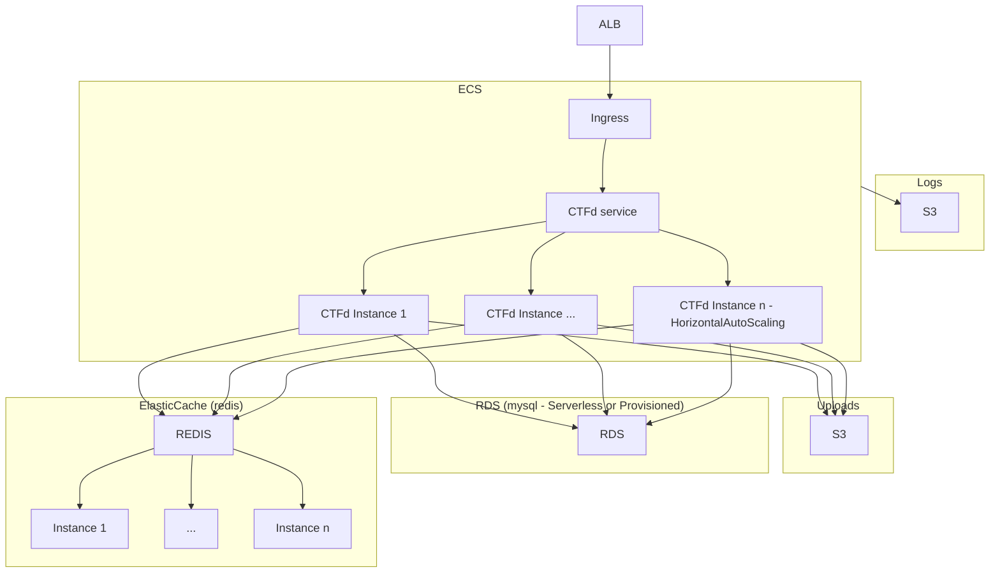

<!-- BEGIN_TF_DOCS -->
# CTFd AWS Terraform module


Terraform module to deploy [CTFd](https://ctfd.io/) into scalable AWS infrastructure

This has been used in a moderately sized CTF > 1000 participants and performed well with a setup similar to the example below, though you may want to scale out a little.

## Design

The CTFd setup Looks something like this:




## Requirements

| Name | Version |
|------|---------|
| <a name="requirement_terraform"></a> [terraform](#requirement\_terraform) | >= 1.0.0 |
| <a name="requirement_aws"></a> [aws](#requirement\_aws) | 4.52.0 |
| <a name="requirement_docker"></a> [docker](#requirement\_docker) | 3.0.1 |
| <a name="requirement_random"></a> [random](#requirement\_random) | 3.4.3 |
## Providers

| Name | Version |
|------|---------|
| <a name="provider_random"></a> [random](#provider\_random) | 3.4.3 |
## Inputs

| Name | Description | Type | Default | Required |
|------|-------------|------|---------|:--------:|
| <a name="input_app_name"></a> [app\_name](#input\_app\_name) | Name of application (ex: "ctfd") | `string` | `"ctfd"` | no |
| <a name="input_aws_region"></a> [aws\_region](#input\_aws\_region) | Region to deploy CTFd into | `string` | `"us-east-1"` | no |
| <a name="input_create_cdn"></a> [create\_cdn](#input\_create\_cdn) | Whether to create a cloudfront CDN deployment. | `bool` | `false` | no |
| <a name="input_create_in_aws"></a> [create\_in\_aws](#input\_create\_in\_aws) | Create AWS resources. If false an instance will be spun up locally with docker | `bool` | `true` | no |
| <a name="input_ctf_domain"></a> [ctf\_domain](#input\_ctf\_domain) | Domain to use for the CTFd deployment. Only used if `create_cdn` is `true` | `string` | `""` | no |
| <a name="input_ctf_domain_zone_id"></a> [ctf\_domain\_zone\_id](#input\_ctf\_domain\_zone\_id) | zone id for the route53 zone for the ctf\_domain. Only used if `create_cdn` is `true` | `string` | `""` | no |
| <a name="input_ctfd_image"></a> [ctfd\_image](#input\_ctfd\_image) | Docker image for the ctfd frontend. | `string` | `"ctfd/ctfd"` | no |
| <a name="input_db_character_set"></a> [db\_character\_set](#input\_db\_character\_set) | The database character set. | `string` | `"utf8mb4"` | no |
| <a name="input_db_cluster_instance_type"></a> [db\_cluster\_instance\_type](#input\_db\_cluster\_instance\_type) | Type of instances to create in the RDS cluster. Only used if db\_serverless set to `false` | `string` | `"db.r5.large"` | no |
| <a name="input_db_collation"></a> [db\_collation](#input\_db\_collation) | The database collation. | `string` | `"utf8mb4_bin"` | no |
| <a name="input_db_deletion_protection"></a> [db\_deletion\_protection](#input\_db\_deletion\_protection) | If true database will not be able to be deleted without manual intervention | `bool` | `true` | no |
| <a name="input_db_engine"></a> [db\_engine](#input\_db\_engine) | Engine for the RDS cluster | `string` | `"aurora-mysql"` | no |
| <a name="input_db_engine_version"></a> [db\_engine\_version](#input\_db\_engine\_version) | Engine version for the RDS cluster | `string` | `"8.0.mysql_aurora.3.02.2"` | no |
| <a name="input_db_name"></a> [db\_name](#input\_db\_name) | Name for the database in RDS | `string` | `"ctfd"` | no |
| <a name="input_db_port"></a> [db\_port](#input\_db\_port) | Port to connect to the RDS cluster on | `number` | `3306` | no |
| <a name="input_db_serverless"></a> [db\_serverless](#input\_db\_serverless) | Configure serverless RDS cluster | `bool` | `true` | no |
| <a name="input_db_serverless_max_capacity"></a> [db\_serverless\_max\_capacity](#input\_db\_serverless\_max\_capacity) | Maximum capacity for serverless RDS. Only used if db\_serverless set to `true` | `number` | `128` | no |
| <a name="input_db_serverless_min_capacity"></a> [db\_serverless\_min\_capacity](#input\_db\_serverless\_min\_capacity) | Minimum capacity for serverless RDS. Only used if db\_serverless set to `true` | `number` | `1` | no |
| <a name="input_db_skip_final_snapshot"></a> [db\_skip\_final\_snapshot](#input\_db\_skip\_final\_snapshot) | If true database will not be snapshoted before deletion. | `bool` | `false` | no |
| <a name="input_db_user"></a> [db\_user](#input\_db\_user) | Username for the RDS database | `string` | `"ctfd"` | no |
| <a name="input_elasticache_cluster_instance_type"></a> [elasticache\_cluster\_instance\_type](#input\_elasticache\_cluster\_instance\_type) | Instance type for instance in ElastiCache cluster | `string` | `"cache.r6g.large"` | no |
| <a name="input_elasticache_cluster_instances"></a> [elasticache\_cluster\_instances](#input\_elasticache\_cluster\_instances) | Number of instances in ElastiCache cluster | `number` | `3` | no |
| <a name="input_elasticache_cluster_port"></a> [elasticache\_cluster\_port](#input\_elasticache\_cluster\_port) | Port to connect to the ElastiCache cluster on | `number` | `6379` | no |
| <a name="input_elasticache_encryption_key_arn"></a> [elasticache\_encryption\_key\_arn](#input\_elasticache\_encryption\_key\_arn) | Encryption key for use with ElastiCache at-rest encryption. Unencrypted if this is empty. | `string` | `""` | no |
| <a name="input_force_destroy_challenge_bucket"></a> [force\_destroy\_challenge\_bucket](#input\_force\_destroy\_challenge\_bucket) | Whether the S3 bucket containing the CTFD challenge data should be force destroyed | `bool` | `false` | no |
| <a name="input_force_destroy_log_bucket"></a> [force\_destroy\_log\_bucket](#input\_force\_destroy\_log\_bucket) | Whether the S3 bucket containing the logging data should be force destroyed | `bool` | `false` | no |
| <a name="input_frontend_desired_count"></a> [frontend\_desired\_count](#input\_frontend\_desired\_count) | Desired number of task instances for the frontend service. | `number` | `2` | no |
| <a name="input_frontend_maximum_percent"></a> [frontend\_maximum\_percent](#input\_frontend\_maximum\_percent) | health percent for the frontend service. | `number` | `150` | no |
| <a name="input_frontend_minimum_healthy_percent"></a> [frontend\_minimum\_healthy\_percent](#input\_frontend\_minimum\_healthy\_percent) | Minimum health percent for the frontend service. | `number` | `75` | no |
| <a name="input_https_certificate_arn"></a> [https\_certificate\_arn](#input\_https\_certificate\_arn) | SSL Certificate ARN to be used for the HTTPS server. | `string` | `""` | no |
| <a name="input_rds_encryption_key_arn"></a> [rds\_encryption\_key\_arn](#input\_rds\_encryption\_key\_arn) | Encryption key for use with RDS at-rest encryption. Unencrypted if this is empty. | `string` | `""` | no |
| <a name="input_registry_password"></a> [registry\_password](#input\_registry\_password) | Password for container registry. Needed if using a private registry for a custom CTFd image. | `string` | `null` | no |
| <a name="input_registry_server"></a> [registry\_server](#input\_registry\_server) | Container registry server. Needed if using a private registry for a custom CTFd image. | `string` | `"registry.gitlab.com"` | no |
| <a name="input_registry_username"></a> [registry\_username](#input\_registry\_username) | Username for container registry. Needed if using a private registry for a custom CTFd image. | `string` | `null` | no |
| <a name="input_s3_encryption_key_arn"></a> [s3\_encryption\_key\_arn](#input\_s3\_encryption\_key\_arn) | Encryption key for use with S3 bucket at-rest encryption. Unencrypted if this is empty. | `string` | `""` | no |
## Outputs

| Name | Description |
|------|-------------|
| <a name="output_challenge_bucket_id"></a> [challenge\_bucket\_id](#output\_challenge\_bucket\_id) | Challenge bucket name |
| <a name="output_lb_dns_name"></a> [lb\_dns\_name](#output\_lb\_dns\_name) | DNS name for the Load Balancer |
| <a name="output_lb_port"></a> [lb\_port](#output\_lb\_port) | Port that CTFd is reachable on |
| <a name="output_log_bucket_id"></a> [log\_bucket\_id](#output\_log\_bucket\_id) | Logging bucket name |
| <a name="output_private_subnet_ids"></a> [private\_subnet\_ids](#output\_private\_subnet\_ids) | List of private subnets that contain backend infrastructure (RDS, ElastiCache, EC2) |
| <a name="output_public_subnet_ids"></a> [public\_subnet\_ids](#output\_public\_subnet\_ids) | List of public subnets that contain frontend infrastructure (ALB) |
| <a name="output_vpc_id"></a> [vpc\_id](#output\_vpc\_id) | Id for the VPC created for CTFd |

## Examples
### AWS Example

```hcl
terraform {
  required_version = ">= 1.0.0"
  required_providers {
    aws = {
      source  = "hashicorp/aws"
      version = "4.52.0"
    }
  }
}

provider "aws" {
  region = "us-east-1"
}

module "ctfd" {
  source                            = "../../" # Actually set to "1nval1dctf/ctfd/aws"
  db_deletion_protection            = false
  elasticache_cluster_instance_type = "cache.t2.micro"
  elasticache_cluster_instances     = 2
  db_serverless                     = true
}
```

### Docker Example

```hcl
terraform {
  required_version = ">= 1.0.0"
}

module "ctfd" {
  source        = "../../" # Actually set to "1nval1dctf/ctfd/aws"
  db_user       = "ctfd"
  db_name       = "ctfd"
  create_in_aws = false
}
```

## Building / Contributing

### Install prerequisites

#### Golang

```bash
wget https://dl.google.com/go/go1.19.5.linux-amd64.tar.gz
sudo tar -C /usr/local -xzf go1.19.5.linux-amd64.tar.gz
rm go1.19.5.linux-amd64.tar.gz
```

#### Terraform

```bash
LATEST_URL=$(curl https://releases.hashicorp.com/terraform/index.json | jq -r '.versions[].builds[].url | select(.|test("alpha|beta|rc")|not) | select(.|contains("linux_amd64"))' | sort -t. -k 1,1n -k 2,2n -k 3,3n | tail -1)
curl ${LATEST_URL} > /tmp/terraform.zip
(cd /tmp && unzip /tmp/terraform.zip && chmod +x /tmp/terraform && sudo mv /tmp/terraform /usr/local/bin/)

```

#### Pre-commit and tools

Follow: https://github.com/antonbabenko/pre-commit-terraform#how-to-install

### Run tests

Default tests will run through various validation steps then spin up an instance with docker.
```bash
make
```

To test the AWS backed version run.
```bash
make test_aws
```

> :warning: **Warning**: This will spin up CTFd in AWS which will cost you some money.
<!-- END_TF_DOCS -->
