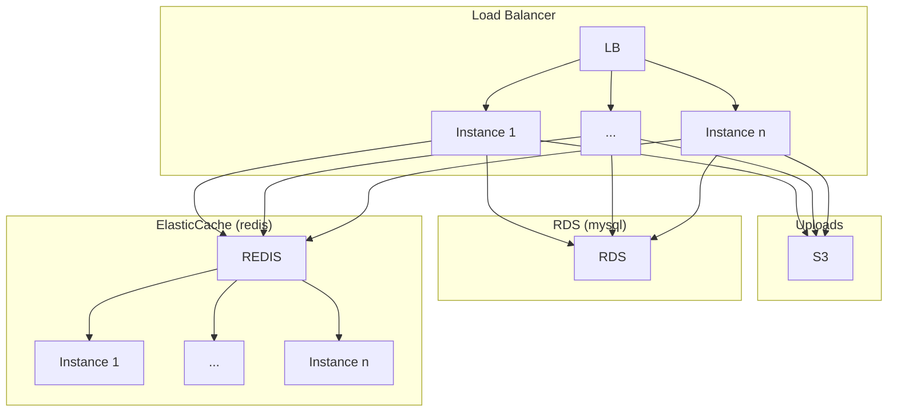

# CTFd AWS Terraform module

[](https://dev.azure.com/invalidctf/invalidctf/_build/latest?definitionId=2&branchName=master)

Terraform module to deploy [CTFd](https://ctfd.io/) into scalable AWS infrastructure

This has been used in a moderately sized CTF > 1000 participants and performed well with a setup similar to the example below, though you may want to scale out a little.

## Usage

```hcl
module "ctfd" {
  source  = "1nval1dctf/ctfd/aws"
  force_destroy_challenge_bucket = true
  db_cluster_instance_type = "db.t2.small"
  db_deletion_protection = false
  elasticache_cluster_instance_type = "cache.t2.micro"
  elasticache_cluster_instances = 2
  asg_instance_type = "t2.micro"
  workers = 3
  worker_connections = 3000
  ctfd_version = "3.3.0"
  # If you need custom themes or plugins create a gzip tarball that can be applied to the root ctfd source checkout directory. i.e. should contain `CTFd/[plugins/themes]/your_extra_stuff`
  ctfd_overlay = "path/to/ctd_overlay.tar.gz"
}
```

## Design

The CTFd setup Looks something like this:



*Note* CTFd does not currently support separate sharding for ElastiCache so the cluster setups is likely overkill for what we get.

## Examples

 * [Simple](examples/simple)

## Inputs

| Name | Description | Type | Default | Required |
|------|-------------|:----:|:-----:|:-----:|
| ctfd_version | Version of CTFd to deploy | string |  | yes |
| ctfd_repo | Git repository to clone CTFd from | string | `https://github.com/CTFd/CTFd.git` | no |
| ctfd_overlay | Path to compressed package to unpack over the top of the CTFd repository. Used to package custom themes and plugins. Must be a gzip compressed tarball | string |  | no |
| app_name | Name of application (ex: `ctfd`) | string | `ctfd` | no |
| vpc_cidr_block | The top-level CIDR block for the VPC. | string | `10.0.0.0/16` | no |
| force_destroy_challenge_bucket | Whether the S3 bucket containing the CTFD challenge data should be force destroyed | bool | false | no |
| elasticache_cluster_id | Id to assign the new ElastiCache cluster | string | `ctfd-cache-cluster` | no |
| elasticache_cluster_instances | Number of instances in ElastiCache cluster. Only used if db_engine_mode set to `provisioned` | number | `3` | no |
| elasticache_cluster_instance_type | Instance type for instance in ElastiCache cluster. Only used if db_engine_mode set to `provisioned` | string | `cache.r6g.large` | no |
| elasticache_cluster_port | Port to connect to the ElastiCache cluster on | number | `6379` | no |
| db_cluster_instances | Number of instances to create in the RDS cluster | number | `1` | no |
| db_cluster_name | Name of the created RDS cluster | string | `ctfd-db-cluster` | no |
| db_cluster_instance_type | Type of instances to create in the RDS cluster | string | `db.r5.large` | no |
| db_engine | Engine for the RDS cluster | string | `aurora-mysql` | no |
| db_engine_mode | Engine mode the RDS cluster | string | `serverless` | no |
| db_engine_version | Engine version for the RDS cluster | string | `5.7.mysql_aurora.2.07.1` | no |
| db_port | Port to connect to the RDS cluster on | number | `3306` | no |
| db_user | Username for the RDS database | string | `ctfd` | no |
| db_name | Name for the database in RDS | string | `ctfd` | no |
| db_deletion_protection | If true database will not be able to be deleted without manual intervention | bool | `true` | no |
| db_skip_final_snapshot | If true database will not be snapshoted before deletion. | bool | `false` | no |
| db_serverless_min_capacity | Minimum capacity for serverless RDS. Only used if db_engine_mode set to `serverless`. | number | 1 | no |
| db_serverless_max_capacity | Maximum capacity for serverless RDS. Only used if db_engine_mode set to `serverless`. | number | 128 | no |
| launch_configuration_name_prefix | Name prefix for the launch configuration | string | `ctfd-web-` | no |
| asg_min_size | Minimum number of instances in frontend auto scaling group | number | `1` | no |
| asg_max_size | Maximum number of instances in frontend auto scaling group | number | `1` | no |
| asg_instance_type | Type of instances in frontend auto scaling group | string | `t3a.micro` | no |
| workers | Number of workers (processes) for gunicorn. Should be (CPU's *2) + 1) based on CPU's from asg_instance_type | number | `5` | no |
| worker_class | Type of worker class for gunicorn | string | `gevent` | no |
| worker_connections | Number of worker connections (pseudo-threads) per worker for gunicorn. Should be (CPU's *2) + 1) * 1000. based on CPU's from asg_instance_type | number | `5000` | no |
| log_dir | CTFd log directory | string | `/var/log/CTFd` | no |
| access_log | CTFd access log location | string | `/var/log/CTFd/access.log` | no |
| error_log | CTFd error log location | string | `/var/log/CTFd/error.log` | no |
| worker_temp_dir | temp location for workers | string | `/dev/shm` | no |
| https_certificate_arn | SSL Certificate ARN to be used for the HTTPS server. If empty then HTTPS is not setup | string | `` | no |
| scripts_dir | Where helper scripts are deployed on EC2 instances of CTFd asg | string | `/opt/ctfd-scripts` | no |
| ctfd_dir | Where CTFd is cloned to on EC2 instances of CTFd asg | string | `/opt/ctfd` | no |
| allowed_cidr_blocks | Cidr blocks allowed to hit the frontend (ALB) | list(string) | `["0.0.0.0/0"]` | no |
| s3_encryption_key_arn | Encryption key for use with S3 bucket at-rest encryption. Unencrypted if this is empty. | string | "" | no |
| rds_encryption_key_arn | Encryption key for use with RDS at-rest encryption. Unencrypted if this is empty. | string | "" | no |
| elasticache_encryption_key_arn | Encryption key for use with ElastiCache at-rest encryption. Unencrypted if this is empty. | string | "" | no |
| create_cdn | Whether to create a cloudfront CDN deployment. | bool | false | no |
| ctf_domain | Domain to use for the CTFd deployment. Only used if `create_cdn` is `true`. | string | "" | no |
| ctf_domain_zone_id | zone id for the route53 zone for the ctf_domain. Only used if `create_cdn` is `true`. | string | "" | no |
| upload_filesize_limit | Nginx setting `client_max_bosy_size` which limits the max size of any handouts you can upload.. | string | "100M" | no |

## Outputs

| Name | Description |
|------|-------------|
| lb_dns_name | DNS name for the Load Balancer |
| lb_dns_zone_id | The canonical hosted zone ID of the Load Balancer |
| s3_bucket | Challenge bucket arn |
| vpc_id | Id for the VPC created for CTFd |
| aws_availability_zones | list of availability zones ctfd was deployed into |
| private_subnet_ids | List of private subnets that contain backend infrastructure (RDS, ElastiCache, EC2) |
| public_subnet_ids | List of public subnets that contain frontend infrastructure (ALB) |
| elasticache_cluster_id | Id of the ElastiCache cluster |
| rds_endpoint_address | Endpoint address for RDS |
| rds_id | Id of RDS cluster |
| rds_port | Port for RDS |
| rds_password | Generated password for the database |

## Debugging

AWS Systems Manager Session Manager is configured on all instances created for this setup. See [here](https://docs.aws.amazon.com/systems-manager/latest/userguide/session-manager.html) for more information.

If you install aws cli and the session manager plugin https://docs.aws.amazon.com/systems-manager/latest/userguide/session-manager-working-with-install-plugin.html

Then you can do the following:
```bash
aws ssm start-session --target [target_id]
```

You may want to find the frontend instances with the following(assuming default app-name)
```bash
aws ec2 describe-instances --filters "Name=tag-value,Values=ctfd-autoscaling-group" --query "Reservations[*].Instances[*].InstanceId"
```

### confirming db connectivity

```bash
(cd /opt/ctfd && sudo -u www-data ../ctfd-scripts/db_check.sh)
```

### confirming gunicorn / CTFd

```bash
curl http://127.0.0.1:8080
```
### confirming gunicorn service

```bash
sudo -u www-data curl --unix-socket /run/gunicorn.sock http
```

### Check cloud-init logs

Look for any errors in the EC2 setup
```bash
cat /var/log/cloud-init-output.log
```

### Manually running CTFd

```bash
sudo systemctl stop gunicorn.service
(cd /opt/ctfd && sudo -u www-data ../ctfd-scripts/gunicorn.sh )
```

### Checking for issues with cloadwatch logging

Confirm the agent is running
```bash
sudo /opt/aws/amazon-cloudwatch-agent/bin/amazon-cloudwatch-agent-ctl -m ec2 -a status
```

View agent logs

```bash
cat /opt/aws/amazon-cloudwatch-agent/logs/configuration-validation.log
```

## Building / Contributing

### Install prerequisites

Golang 

```bash
wget https://dl.google.com/go/go1.15.6.linux-amd64.tar.gz
sudo tar -C /usr/local -xzf go1.15.6.linux-amd64.tar.gz
rm go1.15.6.linux-amd64.tar.gz
```

Terraform

```bash
LATEST_URL=$(curl https://releases.hashicorp.com/terraform/index.json | jq -r '.versions[].builds[].url | select(.|test("alpha|beta|rc")|not) | select(.|contains("linux_amd64"))' | sort -t. -k 1,1n -k 2,2n -k 3,3n -k 4,4n | tail -1)
curl ${LATEST_URL} > /tmp/terraform.zip
(cd /tmp && unzip /tmp/terraform.zip && chmod +x /tmp/terraform && sudo mv /tmp/terraform /usr/local/bin/)
```

### Run tests

Warning this will spin up CTFd in AWS which will cost you some money.

```bash
make
```
