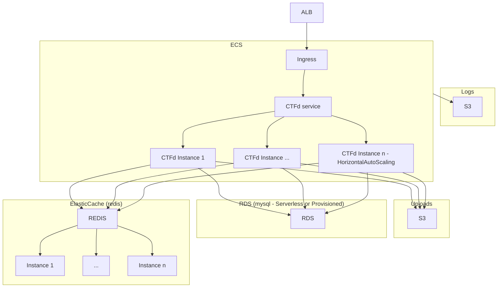

# CTFd AWS Terraform module

Terraform module to deploy [CTFd](https://ctfd.io/) into scalable AWS infrastructure

This has been used in a moderately sized CTF > 1000 participants and performed well with a setup similar to the example below, though you may want to scale out a little.

## Design

The CTFd setup Looks something like this:

